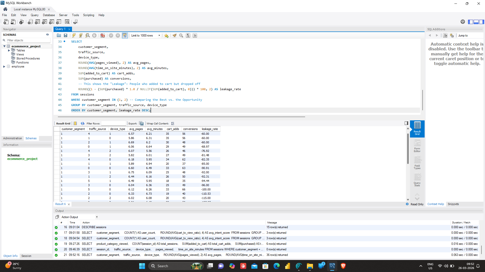

# 📊 E-Commerce Behavioral Pipeline & Conversion Analysis
### *Optimizing the User Journey through Behavioral Segmentation & SQL Analytics*

## 📌 Project Overview
This project transforms raw, unstructured session data into a strategic product roadmap. By building a full-stack analytics pipeline—from **Python-based behavioral clustering** to **SQL-driven revenue attribution**—I identified critical friction points in the conversion funnel and quantified the revenue opportunity within underserved user segments.

---

## 🚀 Phase 1: Feature Engineering & Behavioral Discovery (Python)

**Objective:** Neutralize noisy session data to isolate high-intent user behavior.

* **The Raw Data Challenge:** The initial dataset was "noisy," characterized by high-variance session durations and erratic click counts that didn't directly correlate with sales. 
* **Engineering "Intelligent Features":** To solve this, I engineered metrics that track *quality* over *quantity*:
    * **Intent Score (`cart_to_view_ratio`):** A normalized ratio that measures how effectively a user moves from browsing to "Add to Cart."
    * **Session Velocity:** Calculated as time-on-site divided by pages viewed to identify "decisive" vs. "lost" users.

### Visualizing Interaction Patterns

**Metrics Interpretation:**
* **Revenue Validation:** The **0.73 correlation** between `purchased` and `order_value_usd` confirms that the data is statistically sound for financial forecasting.
* **The Vanity Metric Trap:** I found a negligible **0.07 correlation** between `pages_viewed` and `purchased`. This proves that high engagement (more pages) does not equate to intent, suggesting that long sessions are often a symptom of UI confusion rather than interest.

**Engagement Saturation:** The distribution shows a clear peak at **5–6 pages per session**. Beyond this "saturation point," conversion rates drop significantly, identifying a threshold where users likely become frustrated or distracted.

---

## 📈 Phase 2: Behavioral Segmentation (K-Means Clustering)

I used **K-Means Clustering** to move beyond broad demographics and segment users by their actual interaction patterns. This allows for hyper-personalized product interventions.

| Segment | Archetype | % of Traffic | Behavioral Profile | Product Strategy |
| :--- | :--- | :--- | :--- | :--- |
| **Segment 1** | **The VIPs** | ~15% | High Intent Score, low time-on-site. | **Retention:** Reward with loyalty perks. |
| **Segment 0** | **The Potential** | ~51% | Moderate browsing, 5.18% conversion. | **Conversion:** Use "Nudge" notifications. |
| **Segment 2** | **Window Shoppers**| ~34% | **High Engagement, 0% Conversion.** | **UX Audit:** Fix friction in the checkout. |

**Pairplot Interpretation:** This multivariate analysis shows the clear separation of Segment 1 (Blue), which occupies the high-efficiency zone. Segment 2 (Orange) is visibly "scattered" across high time-on-site but zero purchase events, visually confirming the "Conversion Leak" in our funnel.

---

## 🛠️ Phase 3: Production-Ready Data Infrastructure (SQL)

**Objective:** Build a scalable "Golden Record" environment for real-time stakeholder reporting.

* **Professional ETL Pipeline:** I developed a structured ETL (Extract, Transform, Load) process to migrate ML-enriched data from Python into a **MySQL Relational Schema**. This included optimizing data types for performance and ensuring the `customer_segment` labels were indexed for rapid querying by BI tools.

**Schema Architecture:** The database is structured to support complex joins between session behavior and segmented archetypes, allowing for "Segment-Specific" performance monitoring.

### Advanced Funnel & Attribution Metrics

**Revenue Attribution:** Using **SQL Window Functions** (`SUM OVER`), I calculated the `%_contribution_to_revenue`. This identifies which device-country combinations are over-performing, allowing for targeted ad-spend allocation.

**Funnel Leakage Analysis:** This query calculates the **Leakage Rate** (Add-to-Cart vs. Purchase). By analyzing this across traffic sources, I identified specific channels where users are adding items but dropping off—highlighting a critical need for "Cart Recovery" email flows.

---

## 💡 Strategic Product Insights & Business Impact

### 1. Re-Evaluating North Star Metrics
The data reveals a critical **Vanity Metric Trap**: traditional engagement markers like "Time on Site" show a near-zero correlation ($0.07$) with actual GMV. Product success should instead be measured by **Path-to-Cart Efficiency (Intent Score)**, shifting the focus from keeping users on the platform to moving them through the funnel with minimal friction.

### 2. The Engagement-Conversion Paradox
**Segment 2** represents a massive "Friction-to-Value Gap." Despite comprising **34% of total traffic** and exhibiting the highest site engagement, this segment yields zero revenue. This paradox suggests that our most active users are not "uninterested" but are likely encountering a technical or psychological barrier at the final stage of the journey.

### 3. Prescriptive Growth: Unlocking Latent Revenue
By identifying that **Segment 2** consists of high-engagement "stalled" users rather than low-intent browsers, we can move from descriptive to prescriptive action. Implementing targeted **Exit-Intent Triggers** or simplified **One-Click Checkouts** specifically for this cluster offers the most significant opportunity for immediate conversion lift and revenue reclamation.

---

## 🛠️ Technical Stack
* **Product Analytics:** Python (Pandas, Scikit-Learn), K-Means Clustering, Feature Engineering.
* **Data Infrastructure:** SQL (MySQL), ETL Pipeline Design, Relational Schema Management.
* **Advanced Querying:** Window Functions, CTEs, Multi-Stage Funnel Attribution.
* **Visualization:** Seaborn, Matplotlib, MySQL Workbench Reporting.
