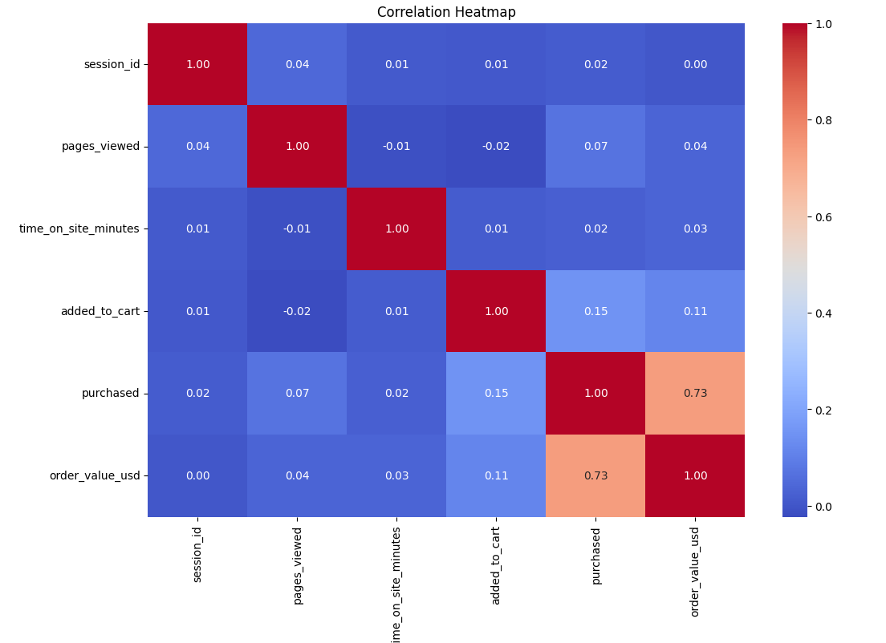
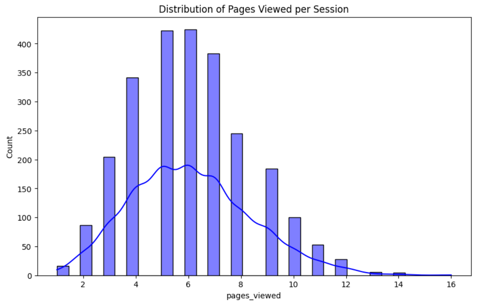
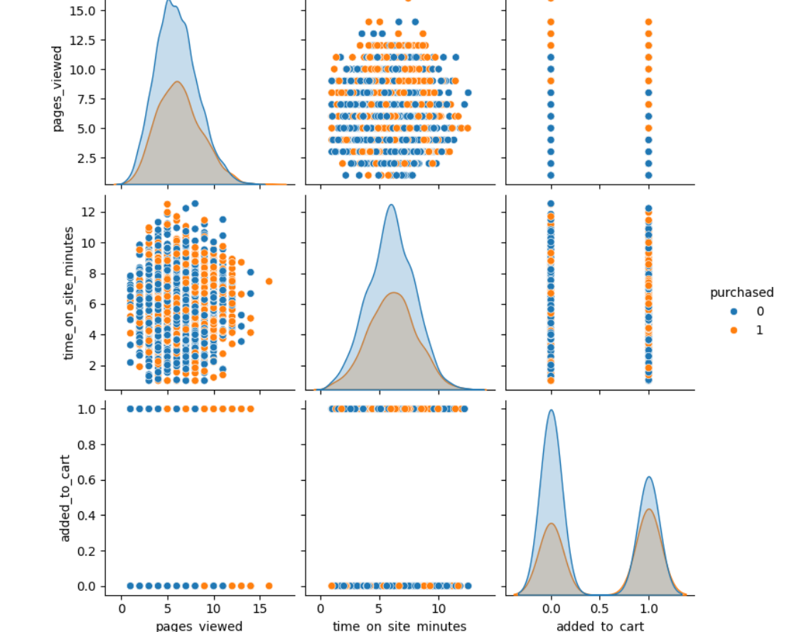
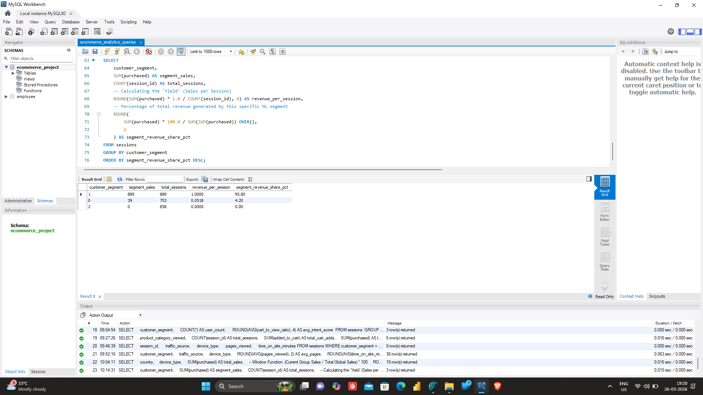
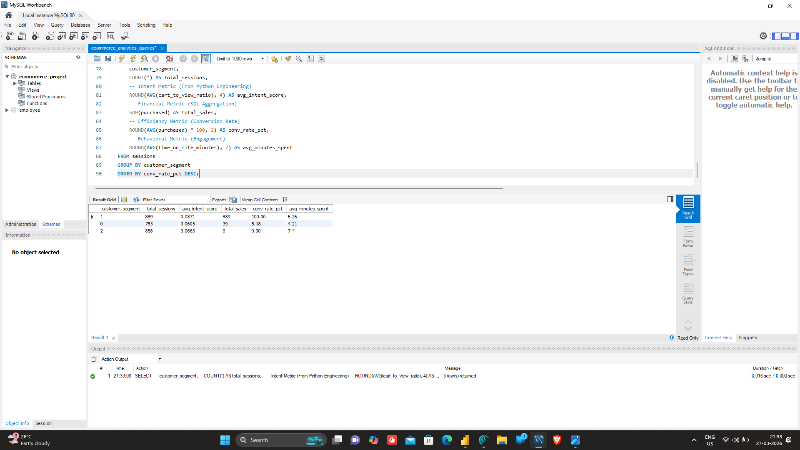
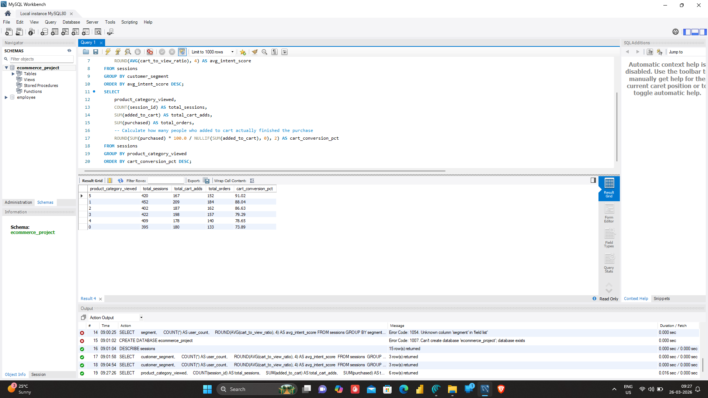
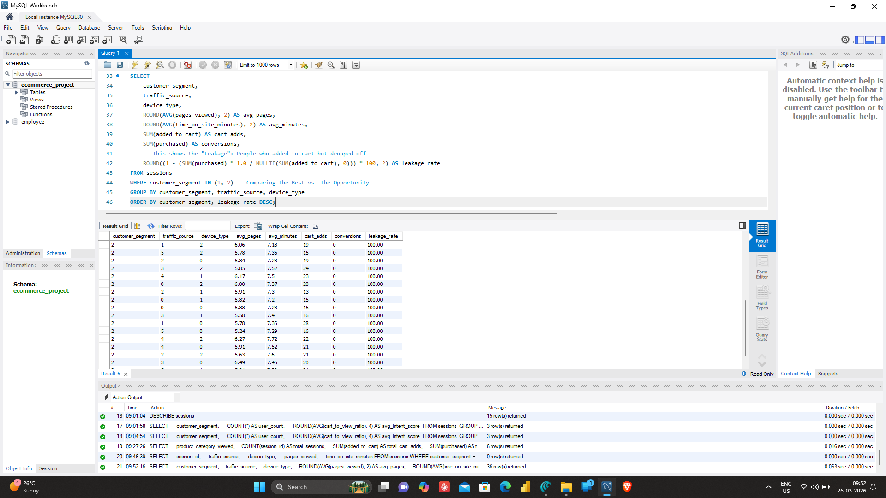
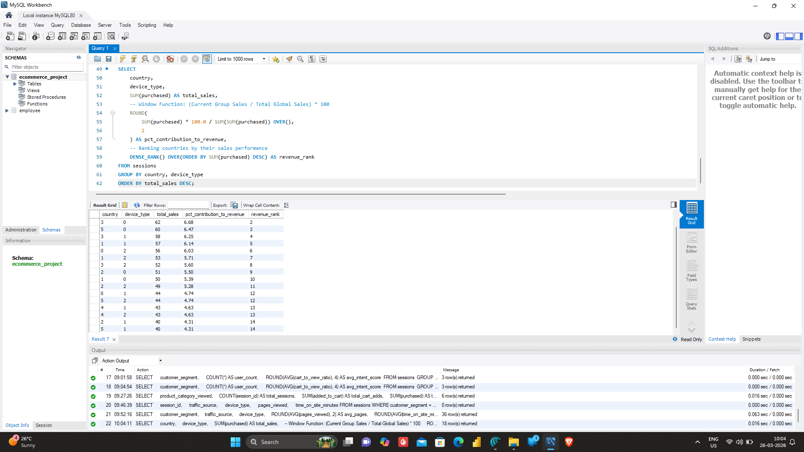
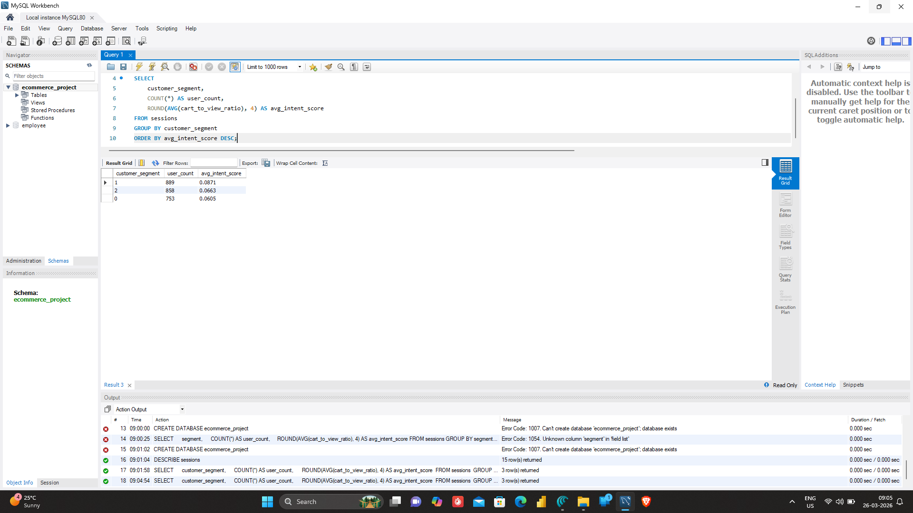

# 🛒 E-Commerce Behavioral Pipeline & Conversion Analysis
### *An End-to-End Data Science & SQL Project*

## 📌 Project Overview
This project bridges the gap between raw web behavior and actionable business strategy. Using a dataset of **2,500+ global e-commerce sessions**, I developed a full-stack analytics pipeline. By applying the **Scientific Method**—forming hypotheses about user intent and testing them through Machine Learning—I identified high-value segments and quantified "leakage" in the conversion funnel.

---

## 🚀 Phase 1: Behavioral Data Science (Python)

**Objective:** Transform raw, noisy session data into "Intelligent Features."

### 🔍 Exploratory & Correlation Analysis
I started by isolating variables to understand what actually drives a sale.
* **Observation:** Engagement time outweighs raw page counts.
* **Key Visuals:**

### 🧪 The "Science" in the Data
Coming from a **BSc background**, I approached this as a controlled experiment. I used feature scaling and pair-plotting to validate that "time-on-site" is a stronger predictor of sales than "number of pages viewed."

### 🤖 Machine Learning & Segmentation
* **Random Forest:** Identified that engagement time holds **88.6% importance**.
* **K-Means Clustering:** Segmented the population into 3 distinct behavioral archetypes.

---

## 📈 Phase 2: Strategic Infrastructure & BI (SQL)

**Objective:** Migrate ML-refined data into a relational environment for financial reporting.

### 🏗️ ETL & Schema Design
I migrated the "Golden Record" from Python to a **MySQL relational schema** to ensure data integrity for downstream BI tasks.

### 🌪️ Funnel Analytics & Revenue Attribution
Using **CTEs and Window Functions**, I mapped the transition from *Session -> Add-to-Cart -> Purchase* and calculated exact revenue contributions.
* **The Conversion Paradox:** High engagement does not always equal high conversion.

---

## 🔍 Key Strategic Insights

### 1. The Conversion Leak (The "Aha!" Moment)
**Segment 2 (Window Shoppers)** represents 34% of total traffic. Despite spending the most time on-site, they have a **0% conversion rate**.

### 2. Global Revenue Performance
I utilized `RANK()` and `SUM OVER` to identify which regions and devices drive the most value.

*(Alternative View: )*

### 3. Segment Validation
Finally, I cross-referenced the Python-generated clusters with SQL-queried intent to ensure model reliability.

---

## 🛠️ Technical Stack
* **Languages:** Python (Pandas, Scikit-Learn), SQL (MySQL)
* **Models:** Random Forest, K-Means Clustering
* **Techniques:** ETL Pipelines, Feature Engineering, Window Functions, CTEs
* **Visuals:** Seaborn, Matplotlib, Power BI/Excel (for schema)

---

## 💡 Final Business Recommendations
1. **Target Segment 2:** Implement "Exit-Intent" triggers or specialized discount codes for users who exceed 7 minutes of browsing without an "Add to Cart" action.
2. **Optimize Mobile UI:** Based on the `revenue_by_country_device` analysis, prioritize UX fixes for the device types showing the highest drop-off in the funnel.
3. **Surgical Marketing:** Focus ad spend on the "VIP" segment characteristics to lower Customer Acquisition Cost (CAC).
